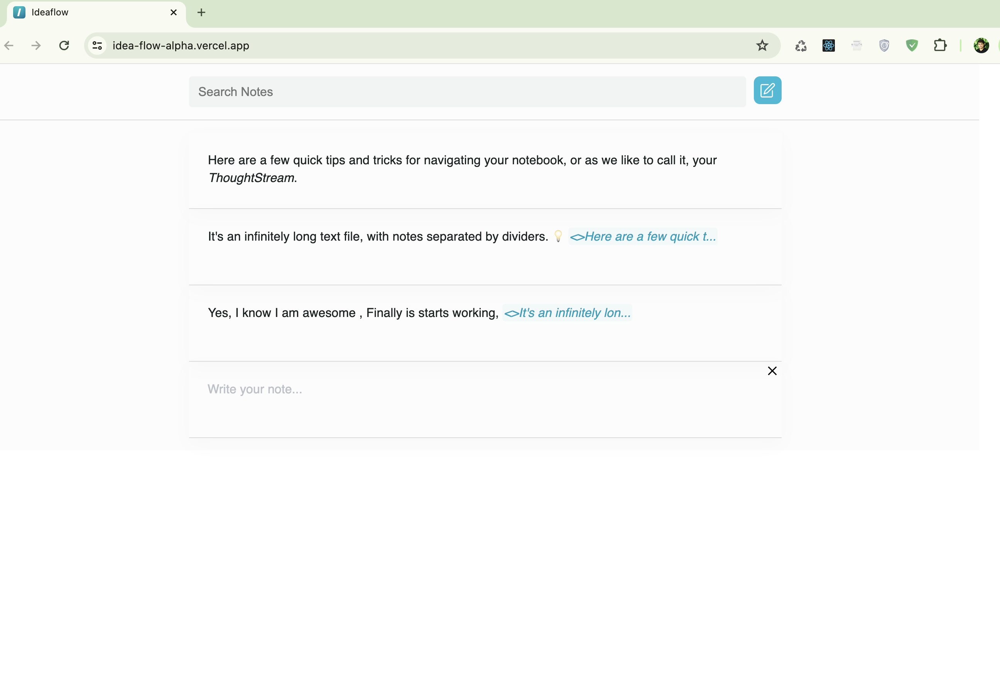
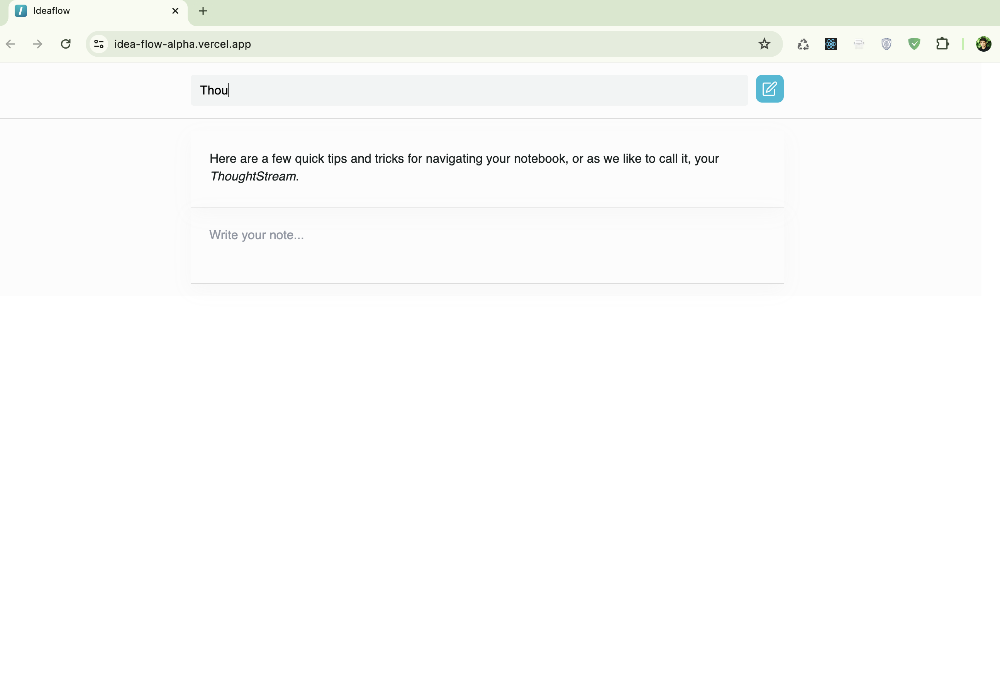
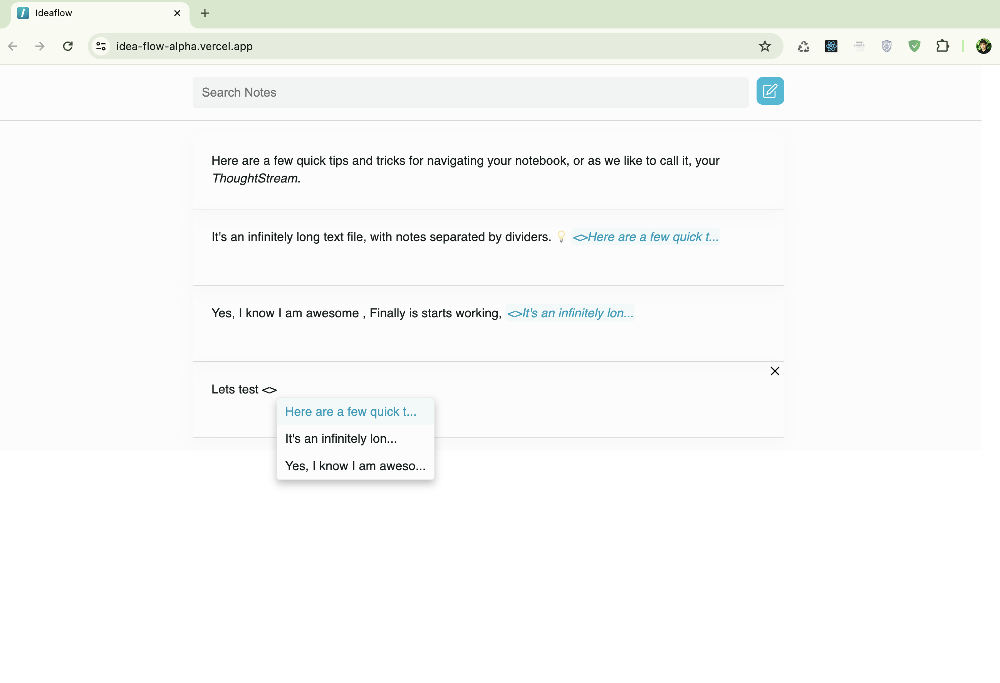
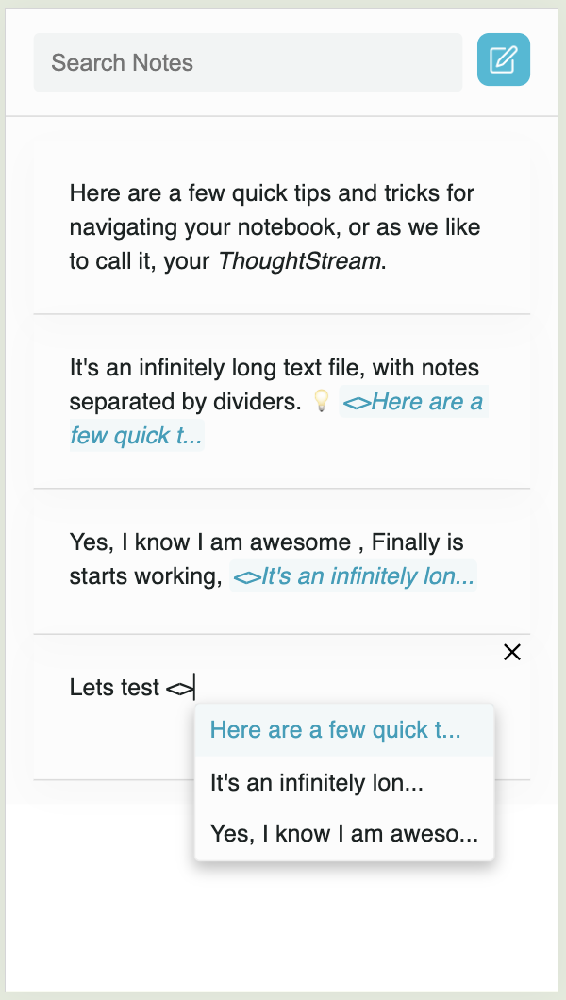

# Implementation 
- Add note through add button next search
- On <> type show suggestions of already written notes
- First suggestion is always selected
- U can navigate in suggestion list through key up and down, it will highlight the suggestion
- Selected suggestion will be added into current paragraph as span with it own styles 
- Backspace will remove the full "autocompleted entry"
- Delete note and Search functionally

Check out : [IdeaflowEditor](https://idea-flow-alpha.vercel.app/)






# Get started
project is create through [vite](https://vitejs.dev/guide/#scaffolding-your-first-vite-project) 
```
npm install
npm run dev
```

## 🚀===================================

# Ideaflow Technical JS take home

Thanks for your interest in Ideaflow!

We will evaluate your code quality, as well as the number of bugs or limitations of your implementation.
We expect you to implement the specs from scratch with Draft.js and not use a plugin.
Current plugins all have limitations and bugs. We also want to evaluate your own coding skills.
Please cite your sources if you decide to inspire yourself from existing code, which is totally fine with us.

We tailored this exercise to take approximately 4h, but time may vary depending on how familiar you are with Draft.js.
Some candidates took 2h, some others 8h.

## Goals

- Build a text editor using Draft.js with autocomplete from this template
- Share your source with us on Github or via an archive
- Deploy your build online

## The text editor

The editor should be capable of taking keyboard and mouse input
to freely edit its content. Classic actions like copy and paste, cut, selections should all work as expected.
The editor should also offer an autocomplete.

### Autocomplete Process

An autocomplete process should be started when the characters `<>` are typed.
The “match string” is the continuous substring extending from the right of the `<>` to the caret. This substring must not contain \n.

### List of Suggestions

When the autocomplete process is ongoing, a list of suggestions should be displayed below the match string.
Every suggestion displayed in the list should be a “match string” prefix. You can hardcode some suggestions.
The suggestions should dynamically update in response to the user's input.
One suggestion should be highlighted at all times.
Pressing ‘up’ and ‘down’ arrow keys should highlight another suggestion.

Pressing ‘enter’ or ‘tab’ will select the highlighted suggestion.
After selecting a suggestion, the editor should display an "autocompleted entry" instead of the match string.
The value of the autocompleted entry should be equal to the highlighted suggestion, or if no suggestion was present, the match string.
Classic mouse interactions should also be allowed to select and highlight suggestions.

### Autocompleted Entry

An "autocompleted entry" should be a different color text and it should not be editable. It can be entirely removed with one ‘backspace’ key press.

## Share

Share your code on Github with `taylormitchell`. You can also send us a zip archive with your sources if it's more convenient for you.

## Deploy

We recommend using Vercel https://vercel.com/guides/deploying-react-with-vercel-cra
Feel free to use another provider if required.
